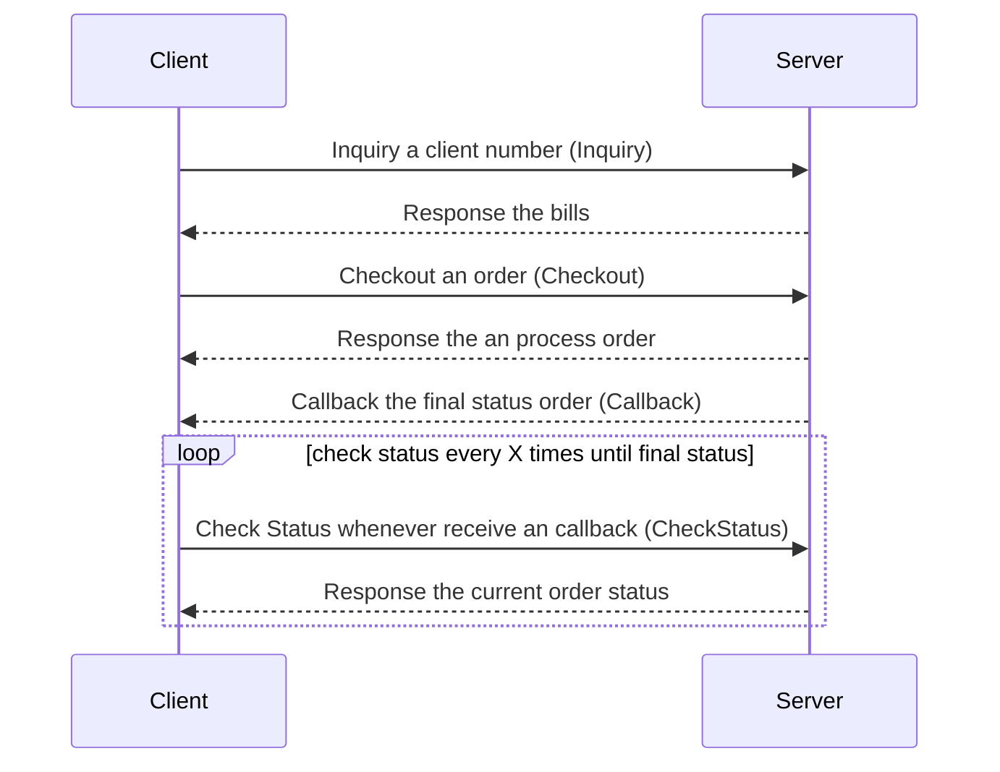
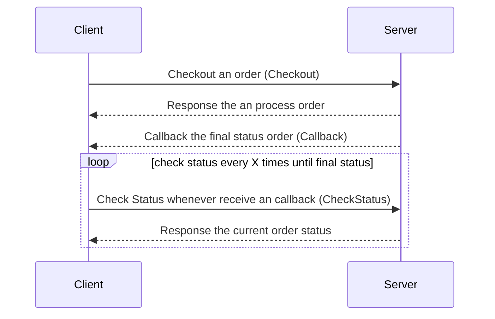

### Python SDK SAT
Python SDK for Tokopedia SAT endpoint.
This SDK can do end to end flow on SAT request, able to inquiry, order, get product list, and much more. Also able to automatically handle signature

#### High Level Diagram
##### Inquiry Product


##### Non Inquiry Product


#### Prerequisite
- Python >= 3.7
- Tokopedia Account registered as Distributor SAT, please follow **DG B2B - Developer Guideline**
- Generate Pair Private Key & Public Key, you can follow **API Documentation Section 2.4 Digital Signature**
- Share your Public Key to [Tokopedia Dev Console](https://developer.tokopedia.com/console/apps) under your current apps. We recommend starting from testing apps.


#### Install Library
```
pip install py-sat-sdk
```


#### Init SDK
Below basic implementation to use the SDK.
```python
from py_sat import SATClientConfig, SATClient

config = (
    SATClientConfig(
        client_id="YOUR_CLIENT_ID", # required
        client_secret="YOUR_CLIENT_SECRET", # required
        private_key="YOUR_PRIVATE_KEY", # required
    )
    # Below is optional parameter
    .with_timeout(10)
    # Public key is optional, used only for callback signature verification
    .with_public_key("SAT_PUBLIC_KEY")
    .with_is_debug(True)
)

sat_client = SATClient(config)
response = sat_client.ping()
```
Use **sat.WithSatBaseURL** to override SAT Base URL when you move to another environment.
Example production environment you can use https://b2b.tokopedia.com/api as the SAT Base URL.

```python
from py_sat import SATClientConfig, SATClient

config = (
    SATClientConfig(
        client_id="YOUR_CLIENT_ID", # required
        client_secret="YOUR_CLIENT_SECRET", # required
        private_key="YOUR_PRIVATE_KEY", # required
    )
    # Below is optional parameter
    .with_timeout(10)
    # Public key is optional, used only for callback signature verification
    .with_public_key("SAT_PUBLIC_KEY")
    # Override SAT Base URL
    .with_sat_base_url("https://b2b.tokopedia.com/api")
)

sat_client = SATClient(config)
response = sat_client.ping()
```

#### Ping
This method allows you to check SAT server health
```python
response = sat_client.ping()
```

#### Account
Account method used to check current your account balance.
This will help you to monitor your account balance.
You can utilize this function to prevent it from insufficient balance.
```python
response = sat_client.account()
```

#### Inquiry
Inquiry method mostly used to check a user bill for a product inquiry type
```python
from py_sat import SATClientConfig, SATClient
from py_sat.models import InquiryRequest, Field

config = (
    SATClientConfig(
        client_id="YOUR_CLIENT_ID", # required
        client_secret="YOUR_CLIENT_SECRET", # required
        private_key="YOUR_PRIVATE_KEY", # required
    )
    # Below is optional parameter
    .with_timeout(10)
    # Public key is optional, used only for callback signature verification
    .with_public_key("SAT_PUBLIC_KEY")
    # Override SAT Base URL
    .with_sat_base_url("https://b2b.tokopedia.com/api")
)

sat_client = SATClient(config)

response = sat_client.inquiry(
    req=InquiryRequest(
        product_code="pln-postpaid",
        client_number="2121212",
        fields=[Field(name="optional", value="optional")],
    )
)

if response.is_success():
    # Handle success here 
    # Type InquiryBaseResponse
    print(response.client_number)
    print(response.client_name)
else:
    # Handle error here
    # Type ErrorResponse
    print(response.get_error_messages())
```

#### Checkout
Checkout allows your system to post the order to SAT server. It means the order will be processed, and your balance will be deducted.
The process will be asynchronous, so you required to implement Check Status to get the final order status.
```python
from py_sat import SATClientConfig, SATClient
from py_sat.models import OrderRequest, Field

config = (
    SATClientConfig(
        client_id="YOUR_CLIENT_ID", # required
        client_secret="YOUR_CLIENT_SECRET", # required
        private_key="YOUR_PRIVATE_KEY", # required
    )
    # Below is optional parameter
    .with_timeout(10)
    # Public key is optional, used only for callback signature verification
    .with_public_key("SAT_PUBLIC_KEY")
    # Override SAT Base URL
    .with_sat_base_url("https://b2b.tokopedia.com/api")
)

sat_client = SATClient(config)

req = OrderRequest(
    id="unique_id",
    product_code="pln-postpaid",
    client_number="2121212",
    amount=12500,
    fields=[
        Field(name="optional", value="optional"),
    ],
)
response = sat_client.checkout(req)

if response.is_success():
    # Handle success here 
    # Type OrderDetail
    print(response.id)
    print(response.client_number)
    print(response.client_name)
else:
    # Handle error here
    # Type ErrorResponse
    print(response.get_error_messages())
```

#### Check Status
Check Status will return the current order status and the detail order information. Please follow our API Doc to handle each error code.

```python
from py_sat import SATClientConfig, SATClient
from py_sat.models import OrderRequest, Field

config = (
    SATClientConfig(
        client_id="YOUR_CLIENT_ID", # required
        client_secret="YOUR_CLIENT_SECRET", # required
        private_key="YOUR_PRIVATE_KEY", # required
    )
    # Below is optional parameter
    .with_timeout(10)
    # Public key is optional, used only for callback signature verification
    .with_public_key("SAT_PUBLIC_KEY")
    # Override SAT Base URL
    .with_sat_base_url("https://b2b.tokopedia.com/api")
)

sat_client = SATClient(config)

req = OrderRequest(
    id="unique_id",
    product_code="pln-postpaid",
    client_number="2121212",
    amount=12500,
    fields=[
        Field(name="optional", value="optional"),
    ],
)
response = sat_client.check_status(request_id)

```

##### Handle Error Code From Order Status Failed
Order Status "Failed" always exposes error code. You can refer to our **API Documentation Section 4.8 Error Response** to handle each error code.
Below snipped code is the example of how you can handle the error code.
```python
from py_sat.models import OrderDetail

response:OrderDetail = sat_client.check_status("unique_id")

if response.is_success() and response.status == "Failed":
    error_code = response.data.error_code
    if error_code == "S00":
        # do something
    elif error_code == "P00":
        # do something
    elif error_code == "U00":
        # do something
```


#### List Product
List product will return all products that are available or specific product when you pass the product code on the parameter.
```python
from py_sat import SATClientConfig, SATClient

config = (
    SATClientConfig(
        client_id="YOUR_CLIENT_ID", # required
        client_secret="YOUR_CLIENT_SECRET", # required
        private_key="YOUR_PRIVATE_KEY", # required
    )
    # Below is optional parameter
    .with_timeout(10)
    # Public key is optional, used only for callback signature verification
    .with_public_key("SAT_PUBLIC_KEY")
    # Override SAT Base URL
    .with_sat_base_url("https://b2b.tokopedia.com/api")
)

sat_client = SATClient(config)
response = sat_client.list_product()
```
You can also filter the product by passing the product code on the parameter.
```python
from py_sat import SATClientConfig, SATClient

config = (
    SATClientConfig(
        client_id="YOUR_CLIENT_ID", # required
        client_secret="YOUR_CLIENT_SECRET", # required
        private_key="YOUR_PRIVATE_KEY", # required
    )
    # Below is optional parameter
    .with_timeout(10)
    # Public key is optional, used only for callback signature verification
    .with_public_key("SAT_PUBLIC_KEY")
    # Override SAT Base URL
    .with_sat_base_url("https://b2b.tokopedia.com/api")
)

sat_client = SATClient(config)
response = sat_client.list_product("25k-xl")
```


#### Callback
Client need to expose the Webhook using HTTP Server and implement the Handler using Callback interface.
Callback will help you to get the final status order real time based on the event via triggered from webhook.

```python
from werkzeug.wrappers import Request, Response
from py_sat.models import OrderDetail
from py_sat import SATClientConfig, SATClient
import logging

config = SATClientConfig(
    client_id="YOUR_CLIENT_ID",  # required
    client_secret="YOUR_CLIENT_SECRET",  # required
    private_key="YOUR_PRIVATE_KEY",  # required
).with_public_key("SAT_PUBLIC_KEY")

sat_client = SATClient(config)


def handler(request: Request) -> Response:
    try:
        data = request.json
        headers = dict(request.headers)

        def do_action(order_detail: OrderDetail):
            assert isinstance(order_detail, OrderDetail)
            assert order_detail.id == "1231231"
            assert order_detail.status == "Success"
            assert order_detail.product_code == "pln-prepaid-token-100k"
            assert order_detail.sales_price == 102500
            assert order_detail.client_name == "User"
            assert order_detail.client_number == "102111106111"

            # Do your action here
            # For example, update your database
            # or send a notification to the customer
            logging.info("Order detail: %s", order_detail)

        sat_client.handle_callback(
            sat_response_data=data,
            sat_response_headers=headers,
            do=do_action,
        )

        return Response(status=200, response=json.dumps({"message": "OK"}))
    except Exception as e:
        logging.exception("Error handling callback")
        return Response(
            status=500,
            response=json.dumps({"error": str(e)}),
        )
```

### Handle Error
This SDK applied standard error payload that always provides error code, error detail, and http status.
Detail error handling each error code will be mentioned in our **API Documentation Section 4.8 Error Response**.
This is an example of how you can handle the error code.
```python
from py_sat.models import InquiryRequest
from py_sat import SATClient, SATClientConfig

config = SATClientConfig(
    client_id="YOUR_CLIENT_ID",  # required
    client_secret="YOUR_CLIENT_SECRET",  # required
    private_key="YOUR_PRIVATE",  # required
).with_public_key("SAT_PUBLIC_KEY")

sat_client = SATClient(config)

response = sat_client.inquiry(
    req=InquiryRequest(
        product_code="not-found-product",
        client_number="2121212",
    )
)

if not response.is_success():
    error_code = response.get_error_codes()
    if error_code == "S00":
        # do something
    elif error_code == "P00":
        # do something
    elif error_code == "U00":
        # do something
```
ResponseGeneralException  is an error coming from non sat server, example: firewall, proxy, client http, etc.
You can parse the http response by yourself and handle it based on your need.
Most of the time you only need to use the http statusCode and handle it.

```python
from py_sat.models import InquiryRequest
from py_sat.exceptions import ResponseGeneralException, GeneralException
from py_sat import SATClient, SATClientConfig

config = SATClientConfig(
    client_id="YOUR_CLIENT_ID",  # required
    client_secret="YOUR_CLIENT_SECRET",  # required
    private_key="YOUR_PRIVATE",  # required
).with_public_key("SAT_PUBLIC_KEY")

try:
    sat_client = SATClient(config)
    response = sat_client.inquiry(
        req=InquiryRequest(
            product_code="pln-postpaid",
            client_number="2121212",
        )
    )
except ResponseGeneralException as e:
    response = e.get_raw_response()
    status_code = response.status_code
    response_body = response.text
except GeneralException as e:
    print(e)
except Exception  as e:
    print(e)
```

### Full Example
Please check on the tests folder to see the full implementation for each method.


### License
The MIT License (MIT)

Copyright (c) 2024 Tokopedia

Permission is hereby granted, free of charge, to any person obtaining a copy of this software and associated documentation files (the "Software"), to deal in the Software without restriction, including without limitation the rights to use, copy, modify, merge, publish, distribute, sublicense, and/or sell copies of the Software, and to permit persons to whom the Software is furnished to do so, subject to the following conditions:

The above copyright notice and this permission notice shall be included in all copies or substantial portions of the Software.

THE SOFTWARE IS PROVIDED "AS IS", WITHOUT WARRANTY OF ANY KIND, EXPRESS OR IMPLIED, INCLUDING BUT NOT LIMITED TO THE WARRANTIES OF MERCHANTABILITY, FITNESS FOR A PARTICULAR PURPOSE AND NONINFRINGEMENT. IN NO EVENT SHALL THE AUTHORS OR COPYRIGHT HOLDERS BE LIABLE FOR ANY CLAIM, DAMAGES OR OTHER LIABILITY, WHETHER IN AN ACTION OF CONTRACT, TORT OR OTHERWISE, ARISING FROM, OUT OF OR IN CONNECTION WITH THE SOFTWARE OR THE USE OR OTHER DEALINGS IN THE SOFTWARE.
